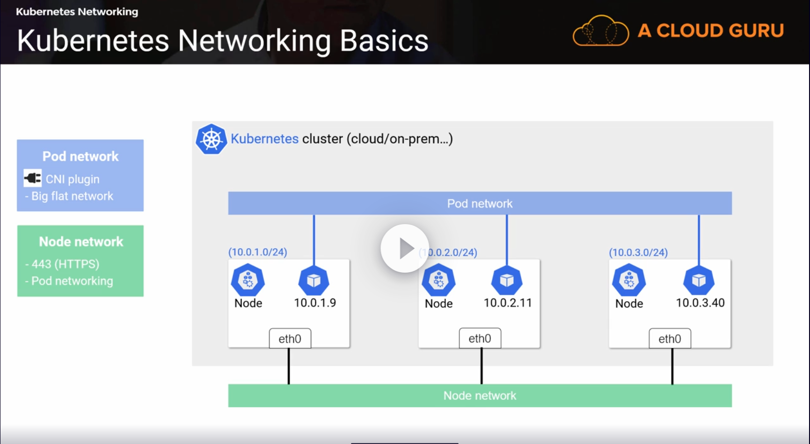
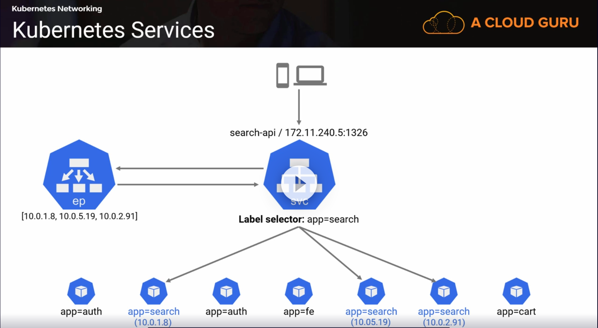
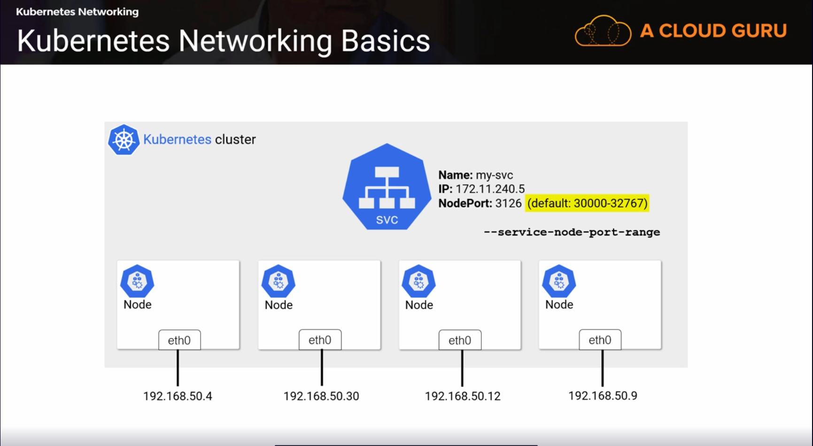
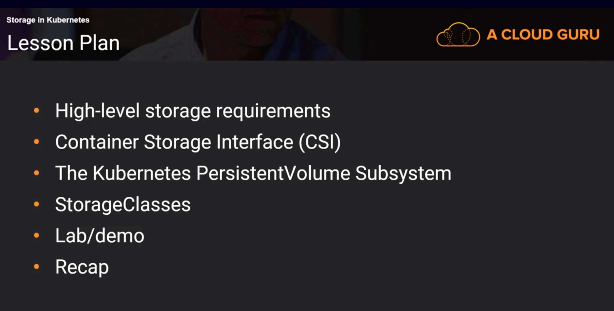
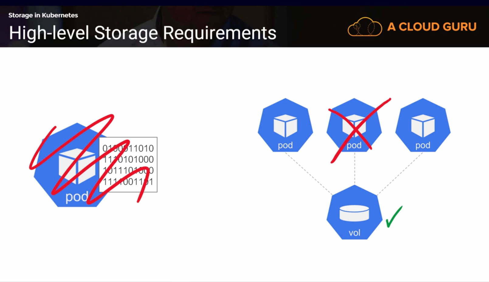
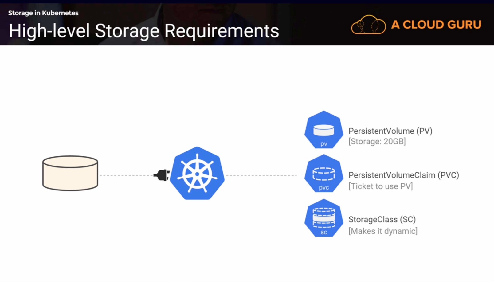
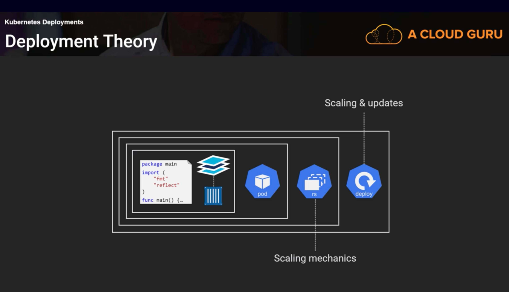

# Learning Kube from acloud.guru

## Resource

[github](https://github.com/ACloudGuru-Resources/Course_Kubernetes_Deep_Dive_NP/tree/master/sample-app/mysql-wordpress-pd)

## Kube Big Picture 
* Control plane (Master Node)
  * etcd
    * Stateful
  * api
    * For CRUD
      * `kubectl get pods`
  * scheduler

* Workers (Worker Node)

### The Kube API

`kubectl get apiservices`

* Alpha => User beware (E.g. v1alpha1)
* Beta => Taking shape. Becoming stable (E.g. v2beta1)
* GA => Ready for production (E.g. V1, V2 etc.)

### The Kube Objects

> Pod
  * Colntains one or more container
  * Atomic unit of scheduling

> Deploy
  * Scalability and application releases
  * Object on the cluster
  * Defined in the apps/v1 API group
  * Scaling
  * Rolling updates

> One Pod per node

> Stateful app components

## Kube Networking

* Common Networking Requirements
* Networking in the Sample App
* Kube Networking basic
* Service
* Service Types
* The Service Network
* Lab
* Summary

### House Rules
* All Nodes can talk
* All Pods can talk (No NAT)
* Every Pod gets it's own IP

### Service

* Every service have
  * Name
  * IP
  > Stable neverchange name and IP whole life

#### Service Type

* ClusterIP (default)
  * Gets own IP
  * Only accessible from within cluster

* NodePord
  * Gets cluster-wide port
  * Also accessible from outside of cluster

  
* LoadBalancer
  * Integrates with public cloud platform

> Get CIDR
`k get no -o jsonpath='{.items[*].spec.podCIDR}'`

### DEMO1
* access to Pod `kubectl exec <POD_NAME> bash`
* update ubuntu in Pod `apt-get update -y`
* install few tools
  * `apt-get install -y iputils-ping curl dnsutils iproute2`

> Connect to NodePort

Need to be in side pod for this method.
* <SERVICE_NAME>:<PORT>
  * `curl hello-svc:8080`

Can access from external
* <NODE_IP>:<NODE_PORT>
  * `curl 172.18.0.3:30001`

## Storage in Kube

### High-level Storage Requirement

> Storage is Vital!!

> Kube Storage

## Container Strage Interface (CSI)

### Access modes
* RWO: ReadWriteOnce
* RWM: ReadWriteMany
* ROM: ReadOnlyMany

### Kube Storate Demo

> IMPORTANT DON'T DO THIS ON PROD
just for demo we use imperative define secretkey
`kubectl create secret generic mysql-pass --from-literal=password=PassPass123`

then check secret
`kubectl get secrets`

## Kube Deployment

